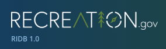
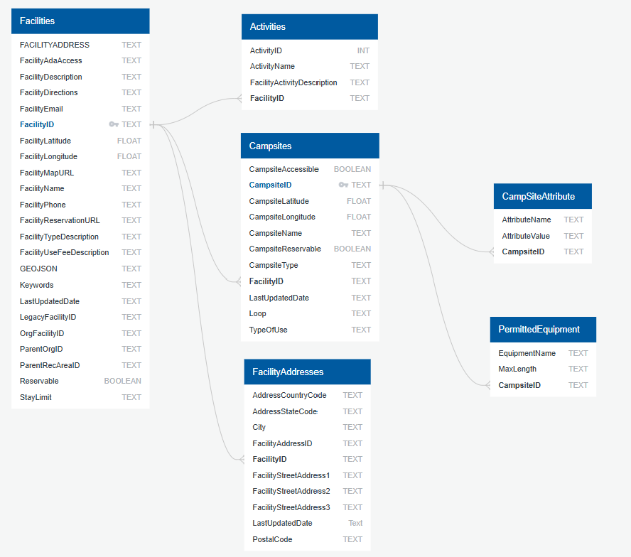
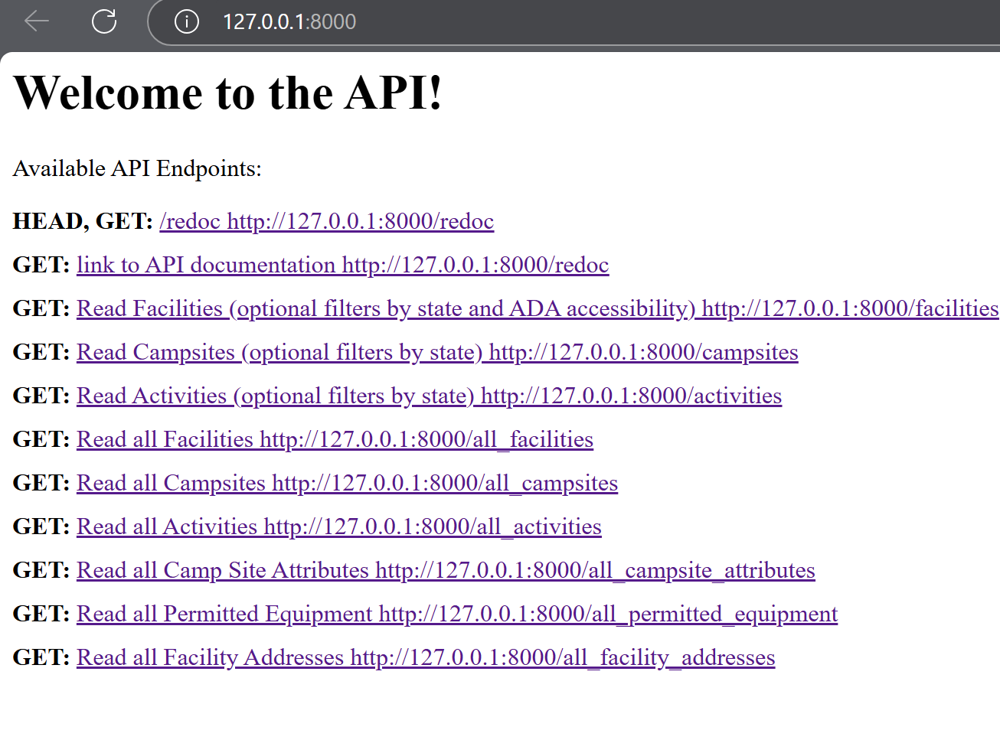
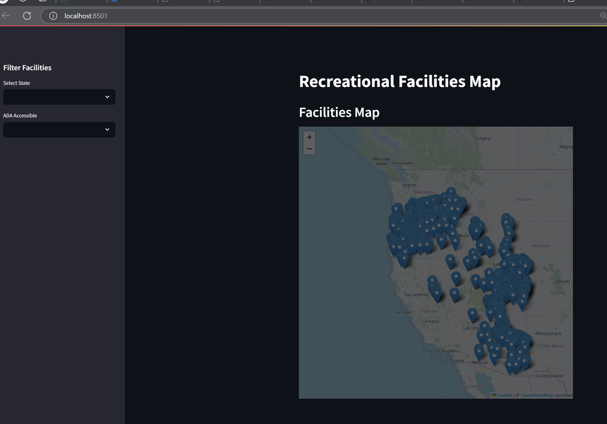

# Project_3_Data_Engineering
Our project was to create a database showing local access to accurate campsite data, enhancing outdoor recreation opportunities in Arizona, Oregon, and Utah. Using the data provided to us on Recreation.gov/, this information can efficiently search for campsite reservation details across those states, ADA accessibility and amenities all in one spot. Local Outdoor Recreation Database, or L.O.R.D.

## Authors
- Jim Cockerham, 2025
[@jimmyc2](https://github.com/jimmyc2)
- Alexis Gutierrez, 2025
[@ag0902](https://github.com/ag0902)
- Andrew Lane, 2025 
[@andrewplane](https://github.com/andrewplane)
- Chris Prada, 2025
[@MCPrada777](https://github.com/MCPrada777)

## Highlights

## Presentation
- [Prezie presentation](https://prezi.com/view/OeNZqec9LOY4W3Nkblfr/)
- [PDF of presentation](Notes/ETL_to_create_the_L.O.R.D.pdf)

## Files
- API_LORD_PGDB.py
- config.py
- create_dataframes.py
- fetch_and_save_data.py
- Localized_Recreation_Map.py
- csv_output
  - activities.csv
  - campsite_attributes.csv
  - campsites.csv
  - fascilities.csv
  - fascility_address.csv
  - permitted_equipment.csv
- DBSetup
  - QuickDBD-recGov.sql
  - DBValidation
    - data-1737323925135.csv
    - PostgresSQL outputcsv.csv
- IMG
  - ERD.png
  - Localized_Rec_Fascilities_Map.png
  - reservation.fields.png
  - Welcome_to_the_API.png
- Initial Notebook
  - recGovDFbuild.ipynb
- json_output
  - fascilities_data.json
- Notes
  - Data Engineering Journey.docx
  - DBD and Validation of Data loaded.docx
  - ETL_to_create_the_L.O.R.D.pdf
- SQL Files
  - querry.sql
  - querry2.sql

New python libraries
Streamlit to generate dashboard: https://pypi.org/project/streamlit/
FastAPI to create API connections:  https://pypi.org/project/fastapi/

## Development
### Obtaining an RIDB API Key

To use the Recreation.gov API (RIDB API), you'll need an API key. This key authenticates your requests and allows you to access the data. Follow these steps to obtain one:

1. **Create a Recreation.gov Account:**
   - If you don't already have one, go to [Recreation.gov](https://www.recreation.gov/) and create an account.
   - Follow the on-screen instructions to register.

2. **Log In to Your Account:**
   - Once you have an account, log in to [Recreation.gov](https://www.recreation.gov/) using your credentials.

3. **Access Your Profile:**
   - After logging in, navigate to your profile page. This is usually found by clicking on your username or avatar in the upper right corner of the screen.
   - Select the **Profile** option (or a similarly labeled item) from the dropdown menu.

4. **Generate an API Key:**
   - On your profile page, look for a section or tab related to API keys, developer settings, or similar (it may be labeled something like "API Keys" or "Developer").
   - Within this section, you'll find an option to generate a new API key. Click on the appropriate button or link (e.g., "Generate API Key", "Create New Key", etc.).
   - If you already have a key you may want to use this one.

5. **Secure Your API Key:**
    - **Important:** Treat your API key like a password! **Do not share it publicly or commit it directly to your code repository.**
    -  Store it securely. Consider using environment variables, a dedicated secrets manager, or your operating system's secure keystore for storing the key during development.  Do not check it into any Git repository!
    - When committing files use `.gitignore` to exclude API keys.
6. **Use the API Key:**
   - You'll need to include your API key in your requests to the RIDB API.  Refer to the [RIDB API documentation](https://ridb.recreation.gov/docs#/) for instructions on how to include the key in the `apikey` request header for each API request.

## Code Documentation

The project's code is documented with comprehensive docstrings, making it easy to understand how each function works and can be used. You can access the docstrings in an interactive Python environment, or by using documentation generation tools such as sphinx.

